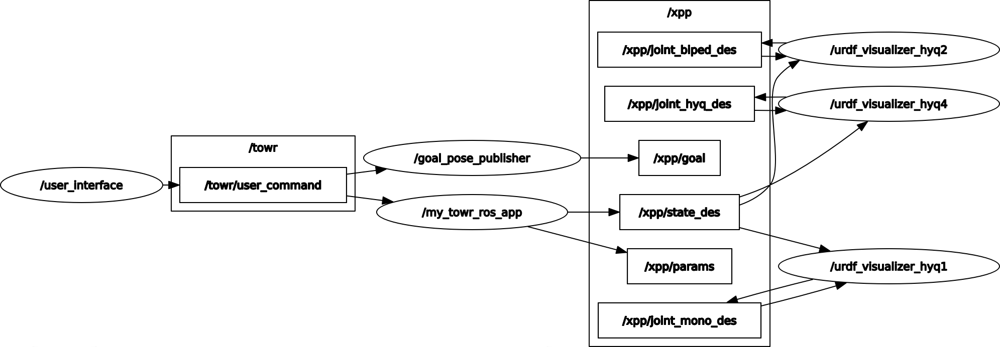

## 1. `O` (Optimize motion)

### 🧩 1. `RobotModel` (模型构建)

**代码行：**
```cpp
formulation_.model_ = RobotModel(static_cast<RobotModel::Robot>(msg.robot));
````

> 💡 **核心概念**
> **`formulation_`**：这是优化问题的总定义对象。
> 此处通过工厂模式构造 `model_`，内部包含两个核心组件：**运动学模型** (`Kinematic`) 和 **动力学模型** (`Dynamic`)。

-----
>eg:src/towr/towr/include/towr/models/examples/biped_model.h

#### 🦵 1.1 运动学模型 (`xxxKinematicModel`)

*继承自 `KinematicModel`，定义“身材”与“活动范围”。*

  * **初始化参数 1：腿部数量**

    ```cpp
    KinematicModel(2)
    ```

    * **含义**：初始化父类，告知系统“我是一个 **2条腿** (Endeffectors) 的机器人”。

  * **初始化参数 2：名义站立姿态 (`nominal_stance_`)**

    ```cpp
    const double z_nominal_b = -0.65; // 身高/腿长
    const double y_nominal_b =  0.20; // 半跨宽

    nominal_stance_.at(L) << 0.0,  y_nominal_b, z_nominal_b; // 左脚
    nominal_stance_.at(R) << 0.0, -y_nominal_b, z_nominal_b; // 右脚
    ```

      * **含义**：定义机器人最自然、默认的站立姿态（相对于 Base 中心）。
      * **参数解析**：
          * `z = -0.65`: 脚在身体下方 **0.65米**。
          * `y = ±0.20`: 两脚间距总宽 **0.4米**。

    > 🤖 **物理画面感**
    > 想象机器人悬在半空中，身体中心是原点 `(0,0,0)`。这两行代码把它的两只脚“摆”到了它该在的空间位置。

  * **初始化参数 3：最大活动范围 (`max_dev_from_nominal_`)**

    ```cpp
    max_dev_from_nominal_ << 0.25, 0.15, 0.15;
    ```

      * **含义**：定义腿的工作空间（Workspace），告诉优化器腿不能无限伸长。
      * **限制范围**（相对于名义位置）：
          * **X轴 (前后)**: $\pm 0.25m$ (迈步/蹬地极限)
          * **Y轴 (左右)**: $\pm 0.15m$ (摆动极限)
          * **Z轴 (上下)**: $\pm 0.15m$ (下蹲/提腿极限)

-----

#### ⚖️ 1.2 动力学模型 (`xxxDynamicModel`)

*继承自 `SingleRigidBodyDynamics`，定义“体重”与“体质”。*

**构造函数：**

```cpp
: SingleRigidBodyDynamics(20, 1.209, 5.583, 6.056, 0.005, -0.190, -0.012, 2)
```

1.  **质量 (Mass)**

      * **值**：`20` (kg)
      * **作用**：基于 $F=ma$，决定了优化器需要计算多大的推力来驱动机器人。

2.  **转动惯量 (Inertia Tensor)**

      * **值**：`1.209, 5.583, 6.056, ...`

      * **含义**：这 6 个数值构成了 $3 \times 3$ 的对称惯性矩阵 $I$：

        $$
        I = \begin{bmatrix} I_{xx} & I_{xy} & I_{xz} \\ I_{yx} & I_{yy} & I_{yz} \\ I_{zx} & I_{zy} & I_{zz} \end{bmatrix}
        $$

      * **主对角线** (`1.209`, `5.583`, `6.056`)：对应 $I_{xx}, I_{yy}, I_{zz}$。数值越大，绕该轴转动越难。

      * **非对角线** (`0.005`, ...): 惯性积，表示质量分布的不对称性。

3.  **腿部计数**

      * **值**：`2`
      * **作用**：再次确认腿部数量，用于接触力变量初始化。

-----
